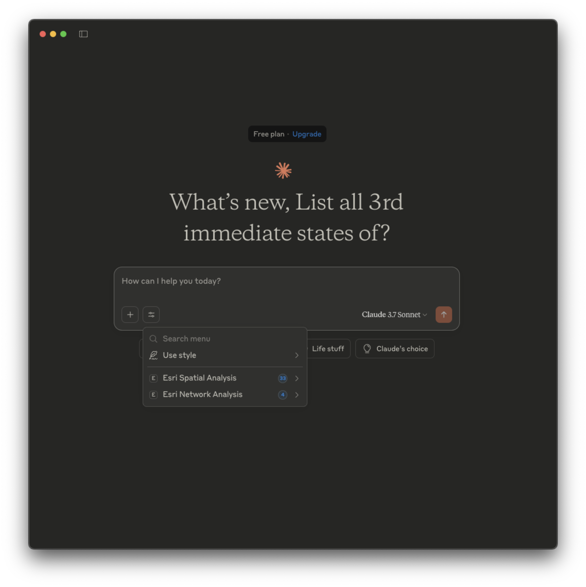
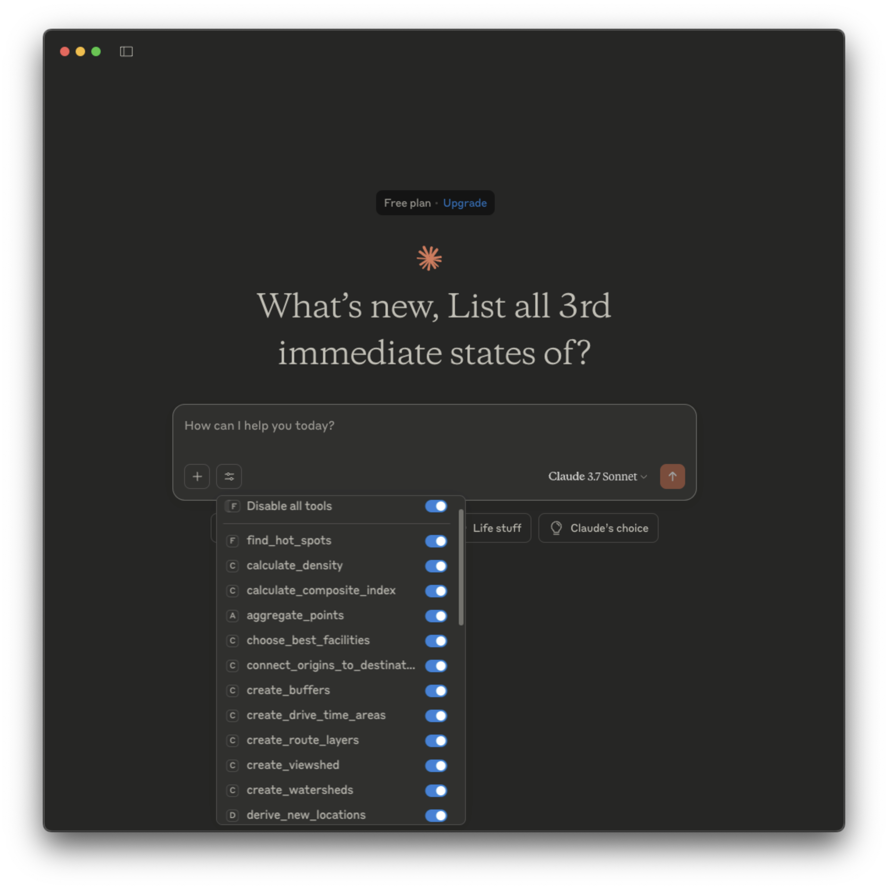

## Esri Network Analysis  & Geocoding MCP Server

#### Build Docker image
`docker build -t  esri/arcgis-mcp-server/geocode-network-analysis -f Dockerfile .`

#### Test Geocoding MCP Server with Docker image 
`docker run -it --rm -e ArcGIS_MAPS_API_KEY="xxxxxxx" -p 8090:8090  esri/arcgis-mcp-server/geocode-network-analysis`

#### Test locally with 
`uv run uvicorn main:app --port 8090`

#### MCP Configure JSON for Claude Desktop App

To make it work, we need to use a proxy gateway to connect Claude App to a remote MCP server. I found this one works for us: https://github.com/supercorp-ai/supergateway

Here is the MCP Proxy Server configuration for Claude Desktop App: 

```json
{
  "mcpServers": {
    "Esri Network Analysis": {
      "command": "npx",
      "args": [
        "-y",
        "supergateway",
        "--sse",
        "https://remote-host-name/mcp/sse"
      ]
    }
  }
}
```


## Esri ArcGIS Spatial Analysis MCP Server

ArcGIS Spatial Analysis MCP Server code is auto-generated by Google Gemini Pro 2.5 Preview. Here is the steps 
to generate all the Python code with Gemini Pro web app: 

1. Follow instructions from https://cloud.google.com/blog/products/ai-machine-learning/build-mcp-servers-using-vibe-coding-with-gemini-2-5-pro/ to save the MCP Protocol quick start page (https://modelcontextprotocol.io/quickstart) to a PDF file. 
2. Save the following blog article from https://modelcontextprotocol.io/quickstart as a PDF file. We need it for generating SSE transport specific code due to the lack of examples from the above protocol quick start page. 
3. Save the Programmatically accessing analysis services page (https://developers.arcgis.com/rest/analysis/api-reference/programmatically-accessing-analysis-services.htm) as a PDF file since it contains sample code to access ArcGIS GPServer based spatial analysis tools. 
4. Save specific ArcGIS Spatial Analysis REST API doc such as https://developers.arcgis.com/rest/analysis/api-reference/sa-find-hot-spots.htm for "Find Hot Spots" tool to a PDF file
5. Open Gemini Pro Web page https://gemini.google.com/app and uploads above 4 PDF file
6. Submit the request with following prompt (modified from above Google Gemini Vibe code page): 
```
instruction = """
You are an MCP server expert. Your mission is to write python code for MCP server. The MCP server development guide and examples including specific SSE transport one are provided.  You must use SSE transport protocol.

Please create MCP server code for ArcGIS "Find Hot Spots" tool. The tool specification is provided as a PDF file above. Python example are provided as PDF files above. 

ArcGIS Online access username and password will be provided as environmental variables. 
"""
```
7. Copy and paste the generated code into a Python IDE like Visual Studio Code or PyCharm, if there are compilation errors, you can just copy and paste the error messages to the Gemini Pro and ask it to fix it. It generated runnable code without any modification after two rounds of fixes! 
8. However, due to the async nature of ArcGIS GPServer and the client has to check the status of a running tool with predefined time interval, Gemini Pro seems having trouble to figure out a way to make MCP server checking the GPServer running status and waiting for its finish before attempting to retrieve the result. Therefore, we had to put a simple wrap around the generated MCP tool function like the following:   
```
@mcp.tool()
async def find_hot_spots(
    analysisLayer: Union[Dict, str],
    analysisField: str = None,
    divideByField: str = None,
    boundingPolygonLayer: Union[Dict, str] = None,
    aggregationPolygonLayer: Union[Dict, str] = None,
    shapeType: str = None,
    cellSize: float = None,
    cellSizeUnits: str = None,
    distanceBand: float = None,
    distanceBandUnits: str = None,
    outputName: str = None,
    context: Dict = None,
) -> Dict:
    # Manually added wrap for the generated mcp tool function (find_hot_spots) 
    loop = asyncio.get_event_loop()
    results = await loop.create_task(
        find_hot_spots_internal(
            analysisLayer=analysisLayer,
            analysisField=analysisField,
            divideByField=divideByField,
            boundingPolygonLayer=boundingPolygonLayer,
            aggregationPolygonLayer=aggregationPolygonLayer,
            shapeType=shapeType,
            cellSize=cellSize,
            cellSizeUnits=cellSizeUnits,
            distanceBand=distanceBand,
            distanceBandUnits=distanceBandUnits,
            outputName=outputName,
            context=context,
        )
    )
    return results


async def find_hot_spots_internal(
    analysisLayer: Union[Dict, str],
    analysisField: str = None,
    divideByField: str = None,
    boundingPolygonLayer: Union[Dict, str] = None,
    aggregationPolygonLayer: Union[Dict, str] = None,
    shapeType: str = None,
    cellSize: float = None,
    cellSizeUnits: str = None,
    distanceBand: float = None,
    distanceBandUnits: str = None,
    outputName: str = None,
    context: Dict = None,
) -> Dict:
    try: 
    ... ... 
```

Once we have above fully functioning MCP Server (`arcgis_mcp_server_spatial_analysis.py`), we then just save remaining 32 GP tools to PDF files plus the working code as a separate code template (PDF file), then upload one or more API PDF files along with the template PDF to Gemini Pro with following prompt: 
```
instruction = """

You are an MCP server expert. Your mission is to write python code for MCP server. The MCP server development guide and examples including specific SSE transport one are provided.  You must use SSE transport protocol.

Please create MCP server TOOL code only for the FIVE ArcGIS spatial analysis tools described with each PDF file above using the provided template "Find_hot_spots_tool". DO NOT generate any other supporting function code, Generate ONLY the MCP server tool.

"""
```

The Gemini Pro will successfully generate one MCP tool for each spatial analysis GP tool, a simple cut and paste the generated code into existing `arcgis_mcp_server_spatial_analysis.py` will make it a MCP Server contains ALL 33 GP tools from https://developers.arcgis.com/rest/analysis/api-reference/getting-started.htm. 
(The only manual editing we did was to comment out some additional citing such as `[cite: 251]` after a correct line of code in some generated tool code (less than a dozen or so).

Here are the screenshots of Spatial Analysis tools loaded in Claude Desktop App: 




